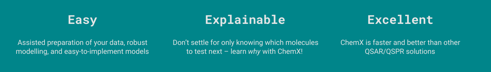

# Welcome to RavensAI's chemX!

***ChemX is our automated machine learning platform specifically designed for molecular data.***

The intuitive user interface of ChemX quides you through curating your data and helps you prepare it for training robust machine learning models. ChemX applies a range of different molecular featurizations to help you find the best one for your data. The resulting models can easily be compared through rich visualizations so you can choose the best model based on robust performance metrics for both regression models and classification models.

ChemX extracts the model’s learnings after-the-fact and presents them to you as easily interpretable plots of contributing and obstructing chemical properties, structure/property relationships mapped directly onto molecular scaffolds, and AI-generated plain text summaries.

The best model is seamlessly implemented into screening workflows by ChemX. You just upload a list of molecules and automatically prepares the molecules for the screening and returns with not only their predicted performance, but also the applied learnings of the model presented on your best predicted molecules.