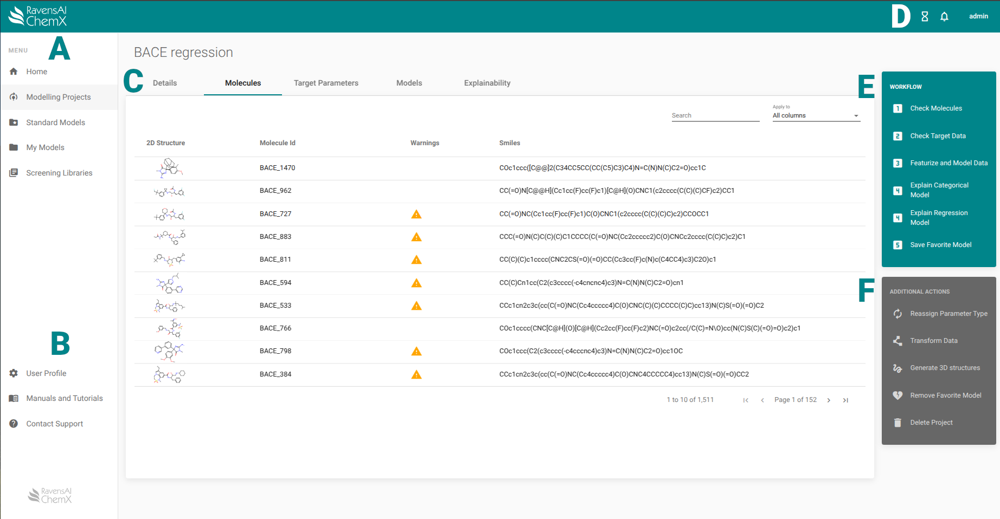

 

:fontawesome-solid-a:{ .letter } 
Navigate between modelling projects, completed models, and screening libraries. 

:fontawesome-solid-b:{ .letter }
Access your User Profile and the Documentation.

:fontawesome-solid-c:{ .letter }
Use the tabs to switch between viewing your molecules, target data, models, and explanations.

:fontawesome-solid-d:{ .letter }
See this session's warnings by clicking the bell icon and log-out by clicking your user name.

:fontawesome-solid-e:{ .letter }
Here you will find the 5 mandatory steps for successfull modelling.

:fontawesome-solid-f:{ .letter }
Additional actions that may be needed during modelling. 

:fontawesome-solid-g:{ .letter }
View and edit information about the project.

