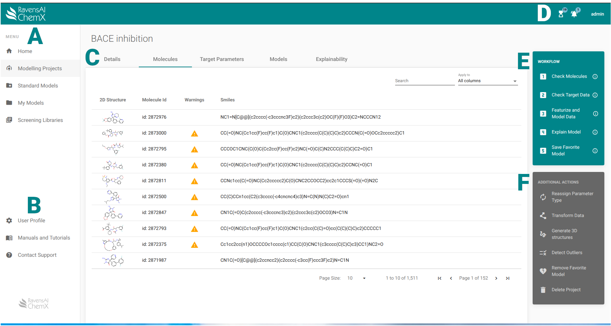

 

:fontawesome-solid-a:{ .letter } 
Navigate between modelling projects, completed models, and screening libraries. 

:fontawesome-solid-b:{ .letter }
Access your User Profile, the Documentation and tutorials, or contact support.

:fontawesome-solid-c:{ .letter }
Use the tabs to switch between viewing project details, molecules, target data, models, and explanations. Project details include the molecule upload log.

:fontawesome-solid-d:{ .letter }
See ongoing tasks by clicking the hour glass, completed tasks by clicking the bell, and log-out by clicking your user name. It is possible to see the status of an ongoing task and kill it from within the hour glass panel. You can click on completed tasks (...) to go to their results.

:fontawesome-solid-e:{ .letter }
Here you will find the 5 mandatory steps for successfull modelling.

:fontawesome-solid-f:{ .letter }
Additional actions that may be needed during modelling. 

