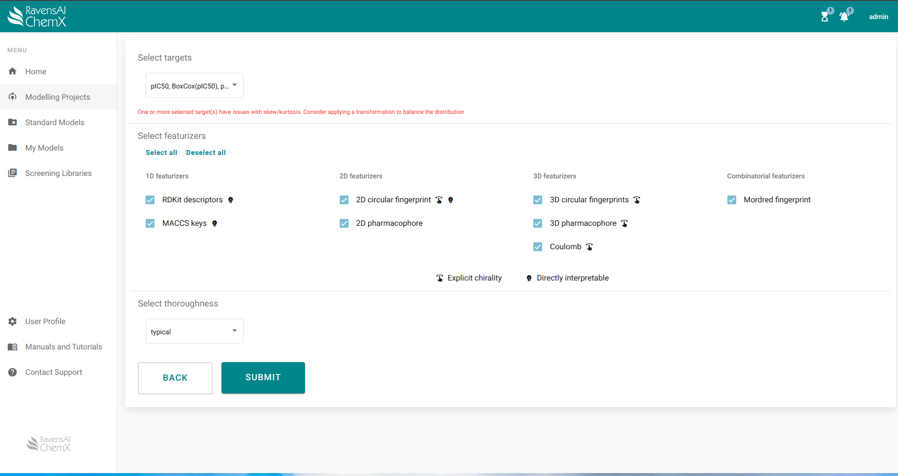

# Introductory tutorial - β-secretase inhibitors

This tutorial will guide you through:  

- [Uploading a dataset](#uploading-a-dataset)
- [Preparing a dataset for modelling](#preparing-a-dataset-for-modelling)
- [Featurization of molecules](#featurization-of-molecules)
- [Identifying the best model](#identifying-the-best-model)
- [Using the model for virtual screening]()
- [Explaining screening results]()

## Reading guide

To ease navigation when doing the tutorial we set up the following style to guide user actions.

This lighter font is the base font and is used when discussing considerations required at each part of the tutorial.

**This bold font denotes actions required to follow the tutorial. When referencing menu items or action items from ChemX are stated in** ***italics***. 

Additionally, we have added boxes with Extended Information which is not esssential to complete the tutorial, but relevant if you are unfamiliar with training machine learning models for molecular datasets.

## Uploading a dataset

**From the left-hand side navigation panel, select** ***Modelling Projects -> Create*** **which leads you to the below view. Here you can add a name and a description of your dataset and select the dataset file for upload. By default the molecules are sanitized during upload.** 

**For the purpose of this tutorial, we will use a public dataset from MoleculeNet called “BACE (Regression)” that can be found in a dropdown menu that appears when clicking** ***Download project data from MoleculeNet***. 

??? info "Extended information: Sanitization"
    Sanitization includes checking the valence state of all atoms, standardization of tautomers, neutralization of molecules (if possible), and removal of hydrogen atoms unless they have an explicitly set isotope, are attached to a chiral atom, or attached to an atom with unusual valence state. If salts or solvents are present in your dataset, the salts will be removed by the sanitizer, and the parent molecule remains. If a molecule fails sanitization it is removed from the dataset.

Following upload, you are taken to the below view. If any molecule presented warnings during sanitization you can find them by sorting the table by "Warning" and look through them by clicking on the molecule. 

 

A common warning is the detection of a chiral molecule that didn’t have a specific chirality assigned. Most often, this warning can be ignored, but if explicit chirality is not assigned, remember that the resulting model will be unable to distinguish between stereoisomers. When you have convinced yourself that all warnings can be ignored, click Target Parameters in the top bar.

??? info "Extended information: 3D structures" 
    The 3D conformation of a molecule is required for some feraturizers, but finding it is generally time consuming. Therefore, users can initiate the conformational search as in independent task immediately after upload (Additional Actions > Generate 3D structures). Otherwise, the conformational search task is initiated if a featurizer that depends on the conformation is selected for modelling. 

    ChemX has different conformational searching algorithms implemented to ensure appropriate sampling for both small molecules and macrocycles.

    If you have preexisting 3D structures of your molecules you can skip this step and upload them directly to ChemX when creating a project.

## Preparing a dataset for modelling

**Click *Target Parameters* in the top bar, and click *pIC50* to get to the view below.**

 

On the left, you are shown a histogram of the uploaded target parameter to help you identify potential problems with your dataset. Below the plot, the min and max values are reported as well as the calculated skew and kurtosis of the distribution. Skew and kurtosis are measures of how close to normally distributed a distribution is. Several of the machine learning algorithms that will be tested in later steps only work if the data is normally distributed, so if your data is not, it is worth trying out a few transformations to try and remedy this. 

**From the right-hand Additional Actions panel, click *Transform Data*. Here you can perform a log transformation, a BoxCox transformation, and a Yeo-Johnson transformation. You can also easily convert your quantitative dataset to a categorical dataset with two bins by defining the threshold between bins.**

If the data remain not normally distributed following transformation it is still possible to train a machine learning model using other algorithms.

??? info "Extended information: Target parameter types" 
    The target parameters are automatically assigned as either categorical or quantitative upon upload. If the automatic assignment was wrong you can reassign the type by clicking Reassign Parameter Type in the Additional Actions panel on the right. Likewise, if you had a column with molecule names in your dataset that was read as a target parameter, you can reassign the column type to text.

??? info "Extended information: Skew and kurtosis" 
    Skew refers to the symmetry of a distribution around the mean while kurtosis refers to a distribution being heavy- or light-tailed compared to a normal distribution or, in other words, being a flat or pointy distribution. 

## Featurization of molecules

Molecules have to be translated into vector or matrix format before you can train a machine learning model. This is called featurization of the molecules. Many different featurizers have been developed and each capture only part of the chemistry of a molecule, so it is important to select a featurizer that can capture the information required to predict a given target parameter. Many featurizers result in highly abstract features and are not easily interpreted if at all. 

**Go to *Workflow > Featurize and Model data*. From a dropdown menu you select which of your target parameters or transforms thereof you would like to train models on, and below that you select which featurizers you would like to base the models on. Click *SUBMIT* when ready to start modelling and go grab a coffee or the like as a modelling job can take hours to complete.**

The featurizers are subdivided into 1D-, 2D-, and 3D featurizers to help users select the appropriate featurizer. Generally, the higher the dimensionality, the higher the complexity, and thus the higher the time required to featurize the molecules. 

 

??? info "Extended information: Featurizers" 
    Translating molecular structure to vector or even matrix format can be done in several different ways. The simplest way is used by the 1D featurizers and is based on counting - either counting atom types, molecular weight, hydrogen bond donors and the like, or by noting the presense or absense of a given functional group and writing down the answers in a fixed format vector format. The resulting featurization can not be translated back to a molecular structure. 2D featurizers are based on the molecular topology, while 3D featurizers depend on a molecule’s 3D structure. Both 2D and 3D featurizers can be based on the atoms of a molecule itself or by its pharmacophore which is a map of interaction partners such as an aromatic moiety, a negative charge, or a hydrogen bond acceptor that may interact with a protein binding site for example.

## Identifying the best model

**When the modelling tasks have completed, you can find the results by clicking *Models* in the top bar.**

 

Each modelling task is summarised in the heatmap with rows indicating a particular view of your data - either the raw data you uploaded or a transformation of that data - and columns indicating the featurizer used during modelling. By default, regression models are compared by their R² performance, but you can easily compare them by their mean absolute error (MAE) or their Spearman correlation coefficient (CC) by clicking the respective buttons above the heatmap. For classification models, the area under the ROC curve is shown by default, but the area under the precision-recall curve can also be used as evaluation metric. 

Each cell represents a series of automated machine learning modelling where a wide range of machine learning algorithms are tried out and hyperparameters are optimized for each one. When the best algorithm and hyperparameter set has been identified, modelling is performed using many different data splits and folds (i.e. division of the data into training- and test sets, a process known as generalized cross validation) to ensure a robust model. Overfitting is further prevented by a bootstrap bias correction cross validation algorithm that corrects the performance estimate. The number of data splits and folds depends on the size of your dataset and the balance between categories. The mean performance from this series of splits is what is shown in the cell.

Be aware that the best regression model may not be the model with the highest R². A few things to consider: 

1. When models are trained multiple times using different data splits for training and testing sets the calculated performance varies to some extent. Therefore, when comparing model performance, the variation should be considered too to assess if two models actually perform differently. Use the reported 95% confidence interval for each model; if the intervals of the models do not overlap their performances are significantly different. Be aware that the opposite is not necessarily the case!
2. Two models with significantly different R² values may not have significantly different MAE and vice versa. 
3. Consider how you intend to use the model down the line. Will it be used as a quick filter on large molecule libraries? If so, then it might be best to choose a slightly less predictive model that uses a quicker featurizer and is much faster to screen with. 
4. Ensure that the model did not pick up on random correlations between target parameter and features e.g. when training a model that predicts orbital energies, a simple featurizer like RDKit descriptors does not encode the chemical complexity necessary to predict quantum mechanical properties. For more information on how to assess this, go to the “Probing the model” section of this tutorial.

??? info "Extended information: Machine learning algorithms and hyperparameters" 
    ChemX tries out the following machine learning algorithms: decision trees, Ridge regression, random forests, and support vector machines.

    While training models, an algorithm will optimize its parameters, e.g. the slope and intercept for a linear regression, but the algorithm’s hyperparameters are set before training and each algorithm has its own set of hyperparameters that adjusts how it models the data. For example, for a random forest algorithm, hyperparameters include number of trees, leaf size, splitting criteria to name a few. 

??? info "Extended information: The R² metric" 
    The R² metric used in ChemX is calculated as one minus the ratio of the mean squared error (MSE) of the model predictions over the MSE of the trivial model predictions (constant number). A value of 1 indicates perfect predictions, while values around 0 indicate that the regression results are no different than the trivial approach of constantly predicting the average value of the outcome. Negative values indicate that the model is worse than the trivial approach.

    The reported R² is therefore not the classic R² many of us have learned in school when learning to fit regression models.

**Clicking a cell in the heatmap gets you to the below view.** Here you can lookup additional perfromance metrics using the dropdown menu, and see how the model performs on the test set as a actual-vs-predicted plot or a residuals plot on the right.

 

## Probing the model 

When a promising model has been identified it is possible to probe the model for what chemical features it found important for predicting the target parameter despite the featurization and machine leattning algorithm likely obscuring interpretation and explainability.

All of the explainanability analyses available in ChemX are calculated relative to a representative molecule of particular interest. This molecule may simply be the best performer from your dataset, but ChemX also allows you to select representatives based on both performance and structural similarity to other molecules in the dataset. 

**Go to *Workflow > Explain Regression Model* which will take you to the view below.**

 

**Select the target parameter and featurizer of the model you are interested in learning more about and inform ChemX if lower og higher values are considered good for your particular target parameter. Then choose between clustering molecules to find representatives or manual selection of molecules before clicking *NEXT*.**

**If you chose manual selection, you get to the below view. If you have a specific molecule of interest you can supply its ID directly. If not, you can choose between top X molecules or top X % of molecules in the dataset as representatives for explainability analysis. X can be set freely in both cases.**

 

**If you chose clustering, you instead get to this view. You can cluster molecules based on their molecular scaffolds or based on overall chemical similarity between molecules. Select if you want to perform the explainability analysis for representatives of all clusters or if you are only interested in the X best/biggest clusters for larger datasets.**

 

??? info "Extended information: Molecular similarity" 
    A Bemis-Murcko scaffold is simply the molecular core of a compound with the side chains removed per a set of predefined rules and with certain hetero atoms being replaced by more generic hetero atom placeholders.
 
    Tanimoto similarity ranges between 0 and 1, with 1 being identical molecules, and is calculated as the normalized overlap between the feature representations of two molecules. In this implementation, the selected featurizer is 2D circular fingerprints.

**To see the results, click *Explainability* in the top bar and select your analysis. You will then see the following view (the example view was found using Murcko scaffolds and using the top 10 performers as representatives).** Be aware that the explainability analysis uses the predicted target parameter and not the actual target parameter from your training set as the analysis is intended to evaluate the model and not the original data.

 

Here you see a list of the representative molecules along with their predicted performance and the size of the cluster they were in. The representative molecules are also highlighted on the UMAP which is a reduced dimension representation of the chemical complexity.

**To see the explanations for a particular molecule, simply click the molecule in the table on the right. Clicking the molecule with ID 3277 from the biggest cluster brings you to the below results.**

 

Here you are presented with 

1. An AI-generated summary of the analysis.
2. Important features from a so-called surrogate model.
3. A counterfactual analysis. 

The feature importance plot is independent of the overall model, and instead is based on a so-called surrogate model. A surrogate model is an interpretable, local model fitted around a data point of interest e.g. the best performing molecule. The shown features are based on 2D circular fingerprints and are those that have the biggest influence on the prediction for the molecule in question. The feature importance is shown on a scale of t-statistics, which evaluates the importance of a feature relative to the average importance. It is similar to the z-score, but applicaple to small datasets. The green and red bars show features that influence the prediction positively and negatively, respectively, and the horisontal yellow line denotes the significance threshold.

A counterfactual is always relative to a representative molecule, and is a molecule that is structurally similar, but functionally different, to the representative molecule. In this case, the representative molecule is one of the best inhibitors in the BACE dataset, and a counterfactual would be near-identical molecules that are poor inhibitors. Analysing the counterfactual molecules for a few of the best inhibitors, e.g. a few with different scaffolds, will help you build an understanding of the structure-property relationship of your data - as the model captured it. 

By analysing the important features and a few counterfactuals, you can start to understand what the model picked up on from your data and use it as a quick sanity check of the model as well.

!!! info "IMPORTANT"
    Be aware that the explainability analysis uses the predicted target parameter and not the target parameter from your training set as the analysis is intended to evaluate the model and not the original data. 

## Using the model for screening

**When you have selected a model you would like to use for screening simply go to *Workflow > Save Favorite Model*.The model and its metadata is now stored under My Models in the left-hand side navigation panel and ChemX will remember the featurizer to use when applying it and how the target paramater was transformed during modelling.**   

**To upload a screening library, simply go to *Screening Libraries* in the left-hand side navigation panel and click *UPLOAD*. When uploaded, you can assess the molecules at *Screening Libraries > YourLibraryName* by clicking *Molecules* in the top bar analogously to when you upload a dataset for modelling.**  

If you don’t have in-house screening libraries of interest it is worth having a look at the [ZINC](https://cartblanche22.docking.org/) or [EnamineReal](https://enamine.net/compound-collections/real-compounds/real-database) databases. Especially ZINC is very handy, as you can download molecule libraries of lead-like molecules or other curated subsets and filter on compound purchasability. 

**To apply a model, simply navigate to the model you want to use or the screening library you want to use it on and click *Screen with Favorite Model* in the *Actions* panel on the right. When the screening is complete, you can find the predictions at *Screening Libraries > YourLibraryName* and go to *Predicted Parameters* in the top bar and clicking the name of the screening task in the list. This will bring you to the below view.**

Here you get an overview of the predicted performance of your library. Did anything perform better than your original dataset? 

When evaluating the results it is important to consider the model’s applicability to your screening library. One way to assess this is by using UMAPs - the reduced dimensionality plots we have seen a few times in this tutorial already. This time we map both the training data and the screening library in the same map to see if the molecules in the screening library are similar to what the model was trained on. If both datasets exist in the different groupings then the chemical complexity is similar. If the map has many distinct groupings with molecules from only one of the datasets then the model, or if there is no overlap at all, then the model has to extrapolate its learnings to unknown chemistry and you should proceed with caution.

!!! warning "IMPORTANT"
    When modelling based on molecular structure, a common pitfall is training you model on one type of chemistry and then using it on another type of chemistry that the model has learnt nothing about.

## Exploring the screening results

When a screening is complete, you can explore the results using the same explainability analyses as was used when probing a model (see the [Probing the model section](#probing-the-model) for details). 

Use the clustering options to identify trends of good performers across the chemical complexity or apply clustering by Murcko scaffold option to look for enriched scaffolds in the data. Perform explainability analysis on top (predicted) performers to ask the model why those molecules were predicted to be so good - what chemical features were important for the prediction and can you start to build a structure-activity relationship from the data?  

